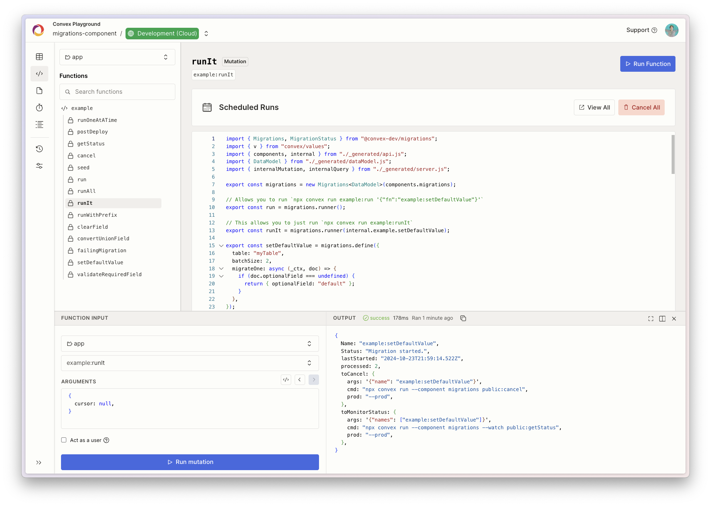

# Convex Stateful Migrations Component

[](https://badge.fury.io/js/@convex-dev%2Fmigrations)

<!-- START: Include on https://convex.dev/components -->

Define and run migrations, like this one setting a default value for users:

```ts
export const setDefaultValue = migrations.define({
  table: "users",
  migrateOne: async (ctx, user) => {
    if (user.optionalField === undefined) {
      await ctx.db.patch(user._id, { optionalField: "default" });
    }
  },
});
```

You can then run it programmatically or from the CLI. See
[below](#running-migrations-one-at-a-time).

Migrations allow you to define functions that run on all documents in a table
(or a specified subset). They run in batches asynchronously (online migration).

The component tracks the migrations state so it can avoid running twice, pick up
where it left off (in the case of a bug or failure along the way), and expose
the migration state in realtime via Convex queries.

See the [migration primer post](https://stack.convex.dev/intro-to-migrations)
for a conceptual overview of online vs. offline migrations. If your migration is
trivial and you're moving fast, also check out
[lightweight migrations in the dashboard](https://stack.convex.dev/lightweight-zero-downtime-migrations).

Typical steps for doing a migration:

1. Modify your schema to allow old and new values. Typically this is adding a
   new optional field or marking a field as optional so it can be deleted. As
   part of this, update your code to handle both versions.
2. Define a migration to change the data to the new schema.
3. Push the migration and schema changes.
4. Run the migration(s) to completion.
5. Modify your schema and code to assume the new value. Pushing this change will
   only succeed once all the data matches the new schema. This is the default
   behavior for Convex, unless you disable schema validation.

See [this Stack post](https://stack.convex.dev/migrating-data-with-mutations)
for walkthroughs of common use cases.

## Pre-requisite: Convex

You'll need an existing Convex project to use the component. Convex is a hosted
backend platform, including a database, serverless functions, and a ton more you
can learn about [here](https://docs.convex.dev/get-started).

Run `npm create convex` or follow any of the
[quickstarts](https://docs.convex.dev/home) to set one up.

## Installation

Install the component package:

```ts
npm install @convex-dev/migrations
```

Create a `convex.config.ts` file in your app's `convex/` folder and install the
component by calling `use`:

```ts
// convex/convex.config.ts
import { defineApp } from "convex/server";
import migrations from "@convex-dev/migrations/convex.config.js";

const app = defineApp();
app.use(migrations);

export default app;
```

## Initialization

Examples below are assuming the code is in `convex/migrations.ts`. This is not a
requirement. If you want to use a different file, make sure to change the
examples below from `internal.migrations.*` to your new file name, like
`internal.myFolder.myMigrationsFile.*` or CLI arguments like `migrations:*` to
`myFolder/myMigrationsFile:*`.

```ts
import { Migrations } from "@convex-dev/migrations";
import { components } from "./_generated/api.js";
import { DataModel } from "./_generated/dataModel.js";

export const migrations = new Migrations<DataModel>(components.migrations);
export const run = migrations.runner();
```

The type parameter `DataModel` is optional. It provides type safety for
migration definitions. As always, database operations in migrations will abide
by your schema definition at runtime. **Note**: if you use
[custom functions](https://stack.convex.dev/custom-functions) to override
`internalMutation`, see
[below](#override-the-internalmutation-to-apply-custom-db-behavior).

## Define migrations

Within the `migrateOne` function, you can write code to modify a single document
in the specified table. Making changes is optional, and you can also read and
write to other tables from this function.

```ts
export const setDefaultValue = migrations.define({
  table: "myTable",
  migrateOne: async (ctx, doc) => {
    if (doc.optionalField === undefined) {
      await ctx.db.patch(doc._id, { optionalField: "default" });
    }
  },
});
```

### Shorthand syntax

Since the most common migration involves patching each document, if you return
an object, it will be applied as a patch automatically.

```ts
export const clearField = migrations.define({
  table: "myTable",
  migrateOne: () => ({ optionalField: undefined }),
});
// is equivalent to `await ctx.db.patch(doc._id, { optionalField: undefined })`
```

### Migrating a subset of a table using an index

If you only want to migrate a range of documents, you can avoid processing the
whole table by specifying a `customRange`. You can use any existing index you
have on the table, or the built-in `by_creation_time` index.

```ts
export const validateRequiredField = migrations.define({
  table: "myTable",
  customRange: (query) =>
    query.withIndex("by_requiredField", (q) => q.eq("requiredField", "")),
  migrateOne: async (_ctx, doc) => {
    console.log("Needs fixup: " + doc._id);
    // Shorthand for patching
    return { requiredField: "<unknown>" };
  },
});
```

## Running migrations one at a time

### Using the Dashboard or CLI

To define a one-off function to run a single migration, pass a reference to it:

```ts
export const runIt = migrations.runner(internal.migrations.setDefaultValue);
```

To run it from the CLI:

```sh
npx convex run convex/migrations.ts:runIt # or shorthand: migrations:runIt
```

**Note**: pass the `--prod` argument to run this and below commands in
production

Running it from the dashboard:



You can also expose a general-purpose function to run your migrations. For
example, in `convex/migrations.ts` add:

```ts
export const run = migrations.runner();
```

Then run it with the
[function name](https://docs.convex.dev/functions/query-functions#query-names):

```sh
npx convex run migrations:run '{fn: "migrations:setDefaultValue"}'
```

See [below](#shorthand-running-syntax) for a way to just pass `setDefaultValue`.

### Programmatically

You can also run migrations from other Convex mutations or actions:

```ts
await migrations.runOne(ctx, internal.example.setDefaultValue);
```

### Behavior

- If it is already running it will refuse to start another duplicate worker.
- If it had previously failed on some batch, it will continue from that batch
  unless you manually specify `cursor`.
- If you provide an explicit `cursor` (`null` means to start at the beginning),
  it will start from there.
- If you pass `true` for `dryRun` then it will run one batch and then throw, so
  no changes are committed, and you can see what it would have done. See
  [below](#test-a-migration-with-dryrun) This is good for validating it does
  what you expect.

## Running migrations serially

You can run a series of migrations in order. This is useful if some migrations
depend on previous ones, or if you keep a running list of all migrations that
should run on the next deployment.

### Using the Dashboard or CLI

You can also pass a list of migrations to `runner` to have it run a series of
migrations instead of just one:

```ts
export const runAll = migrations.runner([
  internal.migrations.setDefaultValue,
  internal.migrations.validateRequiredField,
  internal.migrations.convertUnionField,
]);
```

Then just run:

```sh
npx convex run migrations:runAll # migrations:runAll is equivalent to convex/migrations.ts:runAll on the CLI
```

With the `runner` functions, you can pass a "next" argument to run a series of
migrations after the first:

```sh
npx convex run migrations:runIt '{next:["migrations:clearField"]}'
# OR
npx convex run migrations:run '{fn: "migrations:setDefaultValue", next:["migrations:clearField"]}'
```

### Programmatically

```ts
await migrations.runSerially(ctx, [
  internal.migrations.setDefaultValue,
  internal.migrations.validateRequiredField,
  internal.migrations.convertUnionField,
]);
```

### Behavior

- If a migration is already in progress when attempted, it will no-op.
- If a migration had already completed, it will skip it.
- If a migration had partial progress, it will resume from where it left off.
- If a migration fails or is canceled, it will not continue on, in case you had
  some dependencies between the migrations. Call the series again to retry.

Note: if you start multiple serial migrations, the behavior is:

- If they don't overlap on functions, they will happily run in parallel.
- If they have a function in common and one completes before the other attempts
  it, the second will just skip it.
- If they have a function in common and one is in progress, the second will
  no-op and not run any further migrations in its series.

## Operations

### Test a migration with dryRun

Before running a migration that may irreversibly change data, you can validate a
batch by passing `dryRun` to any `runner` or `runOne` command:

```sh
npx convex run migrations:runIt '{dryRun: true}'
```

### Restart a migration

Pass `null` for the `cursor` to force a migration to start over.

```sh
npx convex run migrations:runIt '{cursor: null}'
```

You can also pass in any valid cursor to start from. You can find valid cursors
in the response of calls to `getStatus`. This can allow retrying a migration
from a known good point as you iterate on the code.

### Stop a migration

You can stop a migration from the CLI or dashboard, calling the component API
directly:

```sh
npx convex run --component migrations lib:cancel '{name: "migrations:myMigration"}'
```

Or via `migrations.cancel` programatically.

```ts
await migrations.cancel(ctx, internal.migrations.myMigration);
```

### Get the status of migrations

To see the live status of migrations as they progress, you can query it via the
CLI:

```sh
npx convex run --component migrations lib:getStatus --watch
```

The `--watch` will live-update the status as it changes. Or programmatically:

```ts
const status: MigrationStatus[] = await migrations.getStatus(ctx, {
  limit: 10,
});
// or
const status: MigrationStatus[] = await migrations.getStatus(ctx, {
  migrations: [
    internal.migrations.setDefaultValue,
    internal.migrations.validateRequiredField,
    internal.migrations.convertUnionField,
  ],
});
```

The type is annotated to avoid circular type dependencies, for instance if you
are returning the result from a query that is defined in the same file as the
referenced migrations.

### Running migrations as part of a production deploy

As part of your build and deploy command, you can chain the corresponding
`npx convex run` command, such as:

```sh
npx convex deploy --cmd 'npm run build' && npx convex run convex/migrations.ts:runAll --prod
```

## Configuration options

### Override the internalMutation to apply custom DB behavior

You can customize which `internalMutation` implementation the underly migration
should use.

This might be important if you use
[custom functions](https://stack.convex.dev/custom-functions) to intercept
database writes to apply validation or
[trigger operations on changes](https://stack.convex.dev/triggers).

Assuming you define your own `internalMutation` in `convex/functions.ts`:

```ts
import { internalMutation } from "./functions";
import { Migrations } from "@convex-dev/migrations";
import { components } from "./_generated/api";

export const migrations = new Migrations(components.migrations, {
  internalMutation,
});
```

See [this article](https://stack.convex.dev/migrating-data-with-mutations) for
more information on usage and advanced patterns.

### Custom batch size

The component will fetch your data in batches of 100, and call your function on
each document in a batch. If you want to change the batch size, you can specify
it. This can be useful if your documents are large, to avoid running over the
[transaction limit](https://docs.convex.dev/production/state/limits#transactions),
or if your documents are updating frequently and you are seeing OCC conflicts
while migrating.

```ts
export const clearField = migrations.define({
  table: "myTable",
  batchSize: 10,
  migrateOne: () => ({ optionalField: undefined }),
});
```

You can also override this batch size for an individual invocation:

```ts
await migrations.runOne(ctx, internal.migrations.clearField, {
  batchSize: 1,
});
```

### Parallelizing batches

Each batch is processed serially, but within a batch you can have each
`migrateOne` call run in parallel if you pass `parallelize: true`. If you do so,
ensure your callback doesn't assume that each call is isolated. For instance, if
each call reads then updates the same counter, then multiple functions in the
same batch could read the same counter value, and get off by one. As a result,
migrations are run serially by default.

```ts
export const clearField = migrations.define({
  table: "myTable",
  parallelize: true,
  migrateOne: () => ({ optionalField: undefined }),
});
```

### Shorthand running syntax:

For those that don't want to type out `migrations:myNewMigration` every time
they run a migration from the CLI or dashboard, especially if you define your
migrations elsewhere like `ops/db/migrations:myNewMigration`, you can configure
a prefix:

```ts
export const migrations = new Migrations(components.migrations, {
  internalMigration,
  migrationsLocationPrefix: "migrations:",
});
```

And then just call:

```sh
npx convex run migrations:run '{fn: "myNewMutation", next: ["myNextMutation"]}'
```

Or in code:

```ts
await migrations.getStatus(ctx, { migrations: ["myNewMutation"] });
await migrations.cancel(ctx, "myNewMutation");
```

## Running migrations synchronously

If you want to run a migration synchronously from a test or action, you can use
`runToCompletion`. Note that if the action crashes or is canceled, it will not
continue migrating in the background.

From an action:

```ts
import { components, internal } from "./_generated/api";
import { internalAction } from "./_generated/server";
import { runToCompletion } from "@convex-dev/migrations";

export const myAction = internalAction({
  args: {},
  handler: async (ctx) => {
    //...
    const toRun = internal.example.setDefaultValue;
    await runToCompletion(ctx, components.migrations, toRun);
  },
});
```

In a test:

```ts
import { test } from "vitest";
import { convexTest } from "convex-test";
import component from "@convex-dev/migrations/test";
import { runToCompletion } from "@convex-dev/migrations";
import { components, internal } from "./_generated/api";
import schema from "./schema";

test("test setDefaultValue migration", async () => {
  const t = convexTest(schema);
  // Register the component in the test instance
  component.register(t);

  await t.run(async (ctx) => {
    // Add sample data to migrate
    await ctx.db.insert("myTable", { optionalField: undefined });

    // Run the migration to completion
    const migrationToTest = internal.example.setDefaultValue;
    await runToCompletion(ctx, components.migrations, migrationToTest);

    // Assert that the migration was successful by checking the data
    const docs = await ctx.db.query("myTable").collect();
    expect(docs.every((doc) => doc.optionalField !== undefined)).toBe(true);
  });
});
```

<!-- END: Include on https://convex.dev/components -->
